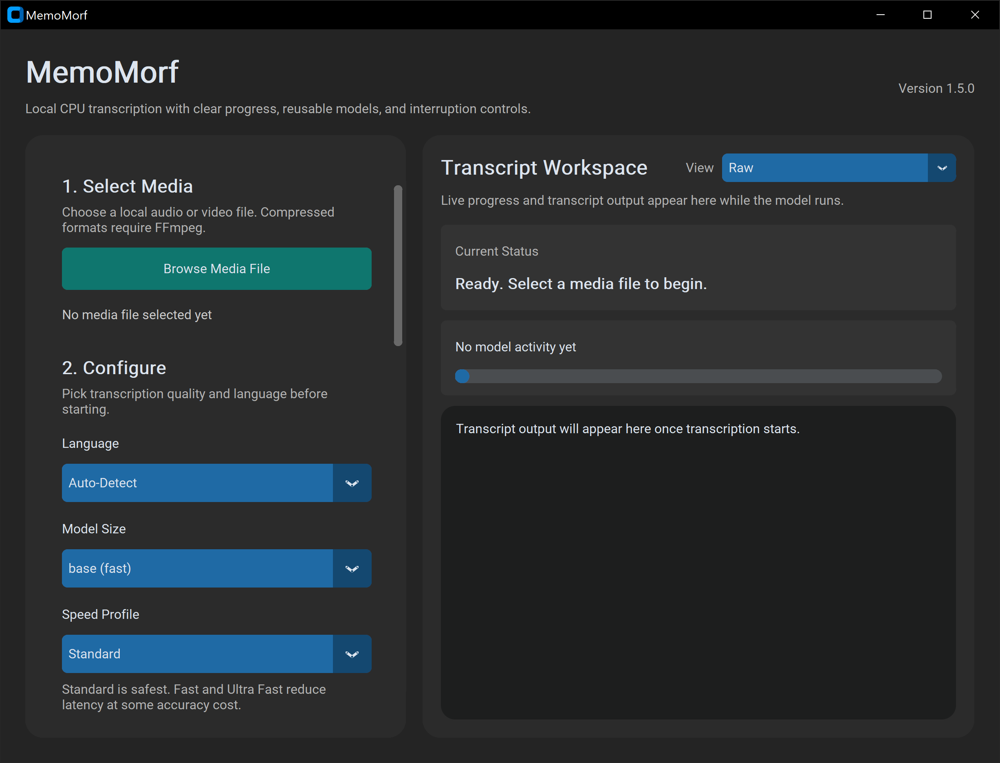
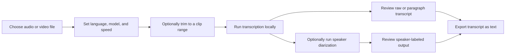
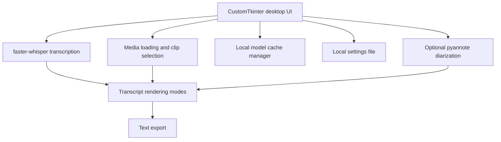

<div align="center">

# MemoMorf

Local-first desktop audio and video transcription with clip selection, model caching, and optional speaker diarization.


Built with CustomTkinter, faster-whisper, and optional pyannote speaker diarization.

</div>



> Fast local transcription, waveform-backed clip selection, reusable model downloads, and speaker-aware transcript review in one desktop workflow.

## Why MemoMorf

| Focus | What you get |
| --- | --- |
| Local workflow | Transcribe audio and video on your machine without a hosted transcription service |
| CPU friendly | Uses `compute_type="int8"` for practical CPU inference |
| Better control | Pause, resume, stop, preview clips, and transcribe only the range you need |
| Reusable models | Keep downloaded models in a local `.models` cache and manage them from the UI |
| Multiple transcript views | Review raw segments, paragraphs, speaker-labeled turns, or speaker-labeled paragraphs |

## Feature Snapshot

- Local CPU transcription with persistent model downloads
- Waveform-backed clip selection with manual times and quick presets
- Live status updates and a real percentage-based download progress bar
- Downloaded Models panel with per-model state and single-model deletion
- Optional speaker diarization for speaker-labeled transcript views
- Windows packaging flow for a standalone executable build

## Workflow



## Architecture



## Transcript Modes

- `Raw`: original segment-by-segment output
- `Paragraphs`: merged text for easier reading
- `Speaker-labeled`: diarized turns with speaker labels
- `Speaker-labeled paragraphs`: grouped speaker-attributed paragraphs

## Requirements

- Python 3.10 or newer
- FFmpeg available on your `PATH`
- Windows PowerShell if you want to use the packaged build script as-is

## Quick Start

Open PowerShell in the project folder and run:

```powershell
py -3 -m venv .venv
.\.venv\Scripts\Activate.ps1
python -m pip install --upgrade pip
pip install -r requirements.txt
```

Install FFmpeg if it is not already available:

```powershell
winget install Gyan.FFmpeg
```

After installing FFmpeg, reopen PowerShell so the updated `PATH` is picked up.

Launch the app:

```powershell
.\.venv\Scripts\Activate.ps1
python .\memomorf.py
```

## Packaging

Install the packaging dependency:

```powershell
pip install -r requirements-dev.txt
```

Build the Windows app:

```powershell
.\build_windows_exe.ps1
```

The packaged app is written to `dist\MemoMorf`.
Run `dist\MemoMorf\MemoMorf.exe` after packaging.
Do not launch the intermediate executable from the `build` folder.

## Supported Media Formats

- `.m4a`
- `.mp3`
- `.wav`
- `.aac`
- `.3gp`
- `.mp4` (audio track of the video is transcribed)

## Storage And Caching

- Whisper models are stored in the local `.models` folder
- UI settings are stored in `.memomorf_settings.json`
- Settings from an older `.transcriber_settings.json` are adopted automatically on first run
- Speaker diarization downloads its own Hugging Face cache on first use
- The `Clear Model Cache` action removes local model data and forces a fresh download later

## Speaker Diarization

Speaker-labeled modes depend on `pyannote/speaker-diarization-community-1`.

Before using speaker-labeled output:

- Accept the Hugging Face model terms for `pyannote/speaker-diarization-community-1`
- Create a Hugging Face access token
- Set the token before launching the app, for example:

```powershell
setx HF_TOKEN "your_token_here"
```

Notes:

- Speaker diarization is slower than plain transcription, especially on CPU
- This repository does not redistribute gated model weights
- Publishing this app does not grant redistribution rights or bypass Hugging Face and pyannote access requirements

## Usage Notes

- `Standard` is the safest speed preset, while `Fast` and `Ultra Fast` trade stability for speed
- Clip ranges accept raw seconds, `mm:ss`, or `hh:mm:ss` values
- Manual clip entry requires both a start and end time
- Presets such as `First 5 min`, `Last 5 min`, and `Current 30s` are available for faster trimming
- Clip preview uses `ffplay`, so your FFmpeg installation should include it
- If transcription fails on compressed formats, verify that FFmpeg is installed and available on your `PATH`

## License

This repository includes the MIT license for the app source code in `LICENSE`.

Third-party packages remain under their own licenses.
See `THIRD_PARTY_NOTICES.md` for a short summary.
